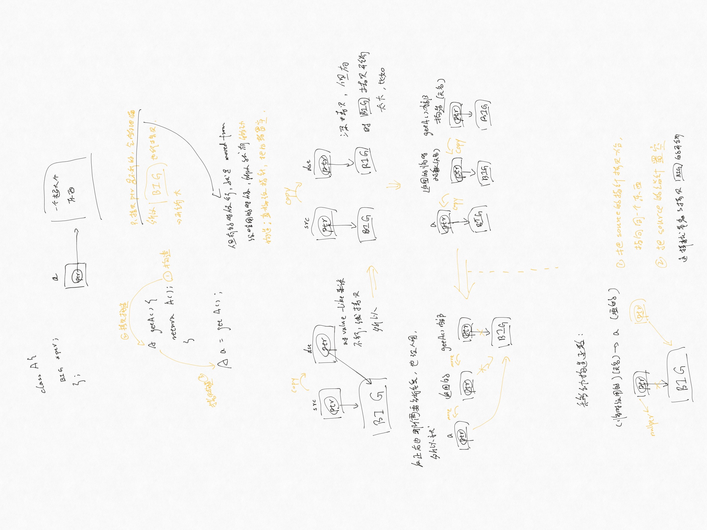
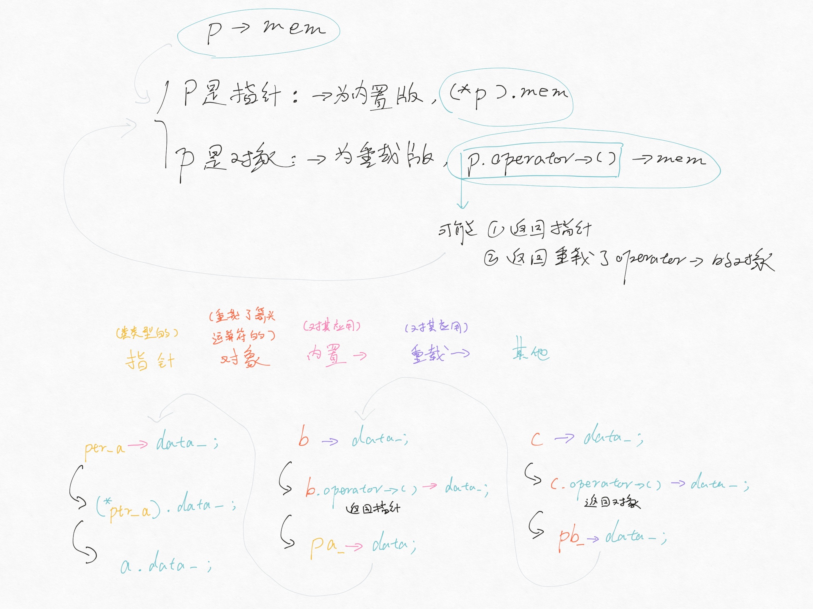

### 第 13 章 拷贝控制

一个类通过定义五种特殊的成员函数来控制此类型对象的拷贝、移动、赋值和销毁操作，它们是：拷贝构造函数（以下简称 copy ctor，下同）、拷贝赋值运算符（copy operator=）、移动构造函数（move ctor）、移动赋值运算符（move operator=）、析构函数（dtor）

接上条，copy / move ctor 定义了用同类型的另一个对象初始化本对象时做什么，copy / move operator= 定义了将一个对象赋予同类型的另一个对象时做什么，dtor 定义了当此类型对象销毁时做什么，以上五种操作统称为拷贝控制操作（copy control）

注意：如果一个类没有定义 *所有* 这些拷贝控制成员，那么编译器会自动为它定义缺失的操作

如果一个 ctor 的第一个参数是自身类类型的引用，而且任何额外参数都有默认值，则此 ctor 是 copy ctor

接上条，copy ctor 第一个参数必须是引用（几乎总是 `const` 的），否则就会不断调用自己。另外 copy ctor 一般不是 `explicit` 的

如果我们没有为一个类定义 copy ctor，则编译器会为我们定义一个（合成 copy ctor），这个编译器给的 copy ctor 会从给定对象中依次将每个非 `static` 成员拷贝到正在创建的对象中（类类型的成员调用其拷贝构造函数，内置类型的直接拷贝，数组不能直接拷贝，但是会被逐元素地拷贝）

所以我们现在知道直接初始化和拷贝初始化之间的差异了：直接初始化事实上是使用普通的函数匹配来选择 ctor，拷贝初始化则是将右侧运算对象拷贝到正在创建的对象中（需要的话还要进行类型转换）：

```cpp
string dots(10, '.');                // 直接初始化
string s(dots);                      // 直接初始化
string s2 = dots;                    // 拷贝初始化
string null_book = "9-999-99999-9";  // 拷贝初始化
string nines = string(100, '9');     // 拷贝初始化
```

拷贝初始化会在以下情况下发生：

- 用 `=` 定义变量
- 将一个对象作为实参传递给一个非引用类型的形参
- 从一个返回类型为非引用类型的函数返回一个对象
- 用花括号列表初始化一个数组中的元素或一个聚合类中的成员

某些类类型还会对它们分配的对象使用拷贝初始化：比如初始化标准库容器或调用其 `insert` 或 `push` 成员时——对比的，用 `emplace` 成员创建的元素都是直接初始化

注意：拷贝初始化不都是调用 copy ctor，有时候会调用 move ctor，后面写

当然如果我们使用的初始化值要求通过一个 `explicit` 的构造函数来进行类型转换，那么使用直接初始化 / 拷贝初始化就 *不* 是无关紧要的了：

```cpp
vector<int> v1(10);  // 正确：直接初始化
vector<int> v2 = 10;  // 错误：接受大小参数的构造函数是 explicit 的
void f(vector<int>);  // f 的参数进行拷贝初始化
f(10);  // 错误：不能用一个 explicit 的构造函数拷贝一个实参
f(vector<int>(10));  // 正确：从一个 int 直接构造一个临时 vector
```

注意：在拷贝初始化过程中，编译器被允许跳过 copy / move ctor 直接创建对象，比如编译器被允许把下面这行代码

```cpp
string null_book = "9-999-99999-9";
```

改成这样：

```cpp
string null_book("9-999-99999-9");
```

但是，即使是编译器略过了 copy / move ctor，在这个程序点上，它（们）也必须存在且可访问

copy operator= 接受一个与其类相同类型的参数（同样一般是 `const` 的），且为了与内置类型的赋值保持一致，一般返回一个指向左侧运算对象的引用（通常标准库对保存在容器中的类型也要求这一点）（*注：原书介绍 copy operator= 的时候超纲了一点运算符重载的知识，这里就不写了，留在下一章*）

和 copy ctor 类似，如果一个类没有定义自己的 copy operator=，则编译器会生成一个合成 copy operator=，它将右侧运算对象的每个非 `static` 成员赋予左侧运算对象的对应成员

dtor 执行与 ctor 相反的工作：ctor 初始化对象的非 `static` 数据成员（还可能做一些其他工作），dtor 释放对象使用的资源，并销毁对象的非 `static` 数据成员

dtor 也是类的一个成员函数，名字由波浪号接类名构成，没有返回值，也不接受参数（所以也不能被重载：对一个给定类，只会有唯一一个 dtor）

ctor 有一个初始化部分和一个函数体：成员按在类中的出现顺序进行初始化，而后执行函数体。类似的，dtor 有一个函数体和一个析构部分：先执行函数体，然后按初始化顺序的逆序销毁成员

接上条，但是在 dtor 中不存在一个类似于 ctor 的初始化列表的东西来控制成员如何销毁：析构部分是隐式的。成员销毁时发生什么完全依赖于成员的类型：销毁类类型成员调用其自身的 dtor，销毁内置类型成员什么也不用做（注意：销毁内置指针类型的成员不会 `delete` 它所指向的对象）

无论何时，只要一个对象被销毁，就会自动调用其 dtor：

- 变量离开作用域时被销毁
- 当一个对象被销毁时，其成员被销毁
- 容器（标准库容器或数组）被销毁时，其元素被销毁
- 对于动态分配的对象，对指向它的指针应用 `delete` 时被销毁
- 对于临时对象，创建它的完整表达式结束时被销毁

注意：当指向一个对象的引用或指针离开作用域时，dtor 不会执行

又来了：如果一个类没有定义自己的 dtor，那么编译器会定义一个合成 dtor，其函数体为空

注意：**dtor 函数体并不直接销毁成员**，成员是在 dtor 函数体之后隐含的析构阶段中被销毁的。换句话说：**在整个销毁过程中，dtor 函数体是作为成员销毁步骤之外的另一部分进行的**

**三 / 五法则 ①：需要析构函数的类也需要拷贝和赋值操作**

**三 / 五法则 ②：需要拷贝操作的类也需要赋值操作，反之亦然**

将拷贝控制成员定义为 `= default` 可以显式要求编译器生成合成的版本（在类内 / 外的区别在于 `inline` 与否）

注：只能对具有合成版本的成员函数使用 `= default`

有些类需要阻止拷贝（比如 `iostream` 类就这么干了，以此避免多个对象写入或读取相同的 IO 缓冲），为此可以将 copy ctor 和 copy operator= 定义为删除的函数：在函数的参数列表后加上 `= delete`

接上条，`= delete` 必须出现在函数第一次声明的时候，而且可以对任意函数指定（有时用以引导函数匹配过程）

注意：**dtor 不能是删除的成员**，否则不能定义该类型的变量，或释放指向该类型动态分配对象的指针

注意：合成的拷贝控制成员有可能是删除的：比如类里有个成员有删除的 / 不可访问的 dtor，那此类的合成的默认 ctor 和 copy ctor 就是删除的，否则可能会创建出无法销毁的对象；又比如类里有个 `const` 成员，那合成的 copy operator= 就是删除的，因为不能把一个新值赋予一个 `const` 成员

接上条，导致合成的拷贝控制成员是删除的的原因有许多，但本质上 **如果一个类有数据成员不能默认构造、拷贝、复制或销毁，则对应的成员函数将被定义为删除的**

注：在 C++ 11 之前类通过将其 copy ctor 和 copy operator= 声明为 `private` 的来阻止拷贝，现在应通过使用 `= delete` 定义 copy ctor 和 copy operator= 以阻止拷贝来取而代之

管理类外资源的类一般来说有两种拷贝语义：行为像值（比如标准库中的 `string`），或行为像指针（比如 `shared_ptr`），当然也有都不像的（比如 IO 类型或 `unique_ptr`，他们根本就不允许拷贝和赋值）

编写 operator= 时有两个要点：如果将一个对象赋予它自身，operator= 必须能正确工作；大多数 operator= 结合了 dtor 和 copy ctor 的工作（所以公共工作一般都由 `private` 的工具函数完成）

接上条，一个好的实践是：在销毁左侧运算对象资源之前拷贝右侧运算对象

管理资源的类通常还定义一个名为 `swap` 的函数，它并非必须，但可能是一种很重要的优化手段（比如对与重排元素顺序的算法一起使用的类）

演示代码如下，注意此段代码中并未 `using namespace std;`：

```cpp
class HasPtr {
  friend void swap(HasPtr &, HasPtr &);

 public:
  // 默认 ctor
  HasPtr(const std::string &s = std::string()) : ps(new std::string(s)), i(0) {}

  // 额外插一嘴：访问级别针对的是类，而不是类的不同对象
  HasPtr(const HasPtr &p) : ps(new std::string(*p.ps)), i(p.i) {}

  // copy operator= 暂未定义
  HasPtr &operator=(const HasPtr &);
  ~HasPtr() { delete ps; }

 private:
  std::string *ps;
  int i;
};

inline void swap(HasPtr &lhs, HasPtr &rhs) {
  using std::swap;  // 注意这一行
  swap(lhs.ps, rhs.ps);
  swap(lhs.i, rhs.i);
}
```

上述代码中有一行很重要（虽然在这段代码里并不重要）：`swap` 函数中调用的 `swap` 并不是 `std::swap`（虽然在这段代码里交换的两个内置类型没有特定版本的 `swap`，所以就是 `std::swap`）

再来一段代码示例：

```cpp
class Foo {
  friend void swap(Foo &, Foo &);

 private:
  HasPtr h;
  double d;
};

// 这样写不对，因为内部调用的是 std::swap 而非 HasPtr 版本的 swap
inline void swap(Foo &lhs, Foo &rhs) {
  std::swap(lhs.h, rhs.h);
  std::swap(lhs.d, rhs.d);
}

// 这样就对了，内部调用的是 HasPtr 版本的 swap
inline void swap(Foo &lhs, Foo &rhs) {
  using std::swap;
  swap(lhs.h, rhs.h);
  swap(lhs.d, rhs.d);  // 这里还是 std::swap
}
```

每个 `swap` 调用应该都是未加限定的，如果存在类型特定的 `swap`，其匹配优先程度会优于 `std::swap`（原因见第 16 章），`swap` 函数中的 `using` 声明不会隐藏特定版本的 `swap` 声明（原因见第 18 章）

定义了 `swap` 的类常用 `swap` 来定义它们的 operator=，这些运算符使用 *拷贝并交换* 技术，将左侧运算对象与右侧运算对象的一个副本进行交换：

```cpp
// 注意 rhs 是按值传递的，意味着 HasPtr 的 copy ctor
// 将右侧运算对象中的 string 拷贝到 rhs
HasPtr &HasPtr::operator=(HasPtr rhs) {
  // 交换左侧运算对象和局部变量 rhs 的内容
  swap(*this, rhs);  // rhs 现在指向本对象曾经使用的内存
  return *this;      // rhs 被销毁，从而 delete 了 rhs 中的指针
}
```

如上述代码：使用 *拷贝并交换* 技术的 operator= 自动就是异常安全的，而且能正确处理自赋值

在讨论对象移动前先看张图：



如上图所示，很多情况下对象拷贝后就立刻被销毁了，此时移动而非拷贝对象能大幅提升性能

接上条，移动元素而非拷贝的另一个原因是某些类包含不能被共享的资源（如 IO 类的 IO 缓冲，或 `unique_ptr` 的指针），这些类型的对象不能拷贝但是可以移动（额外提一句：容器可以保存不可拷贝的类型，只要它们能被移动即可）

为了支持移动操作，我们有必须绑定到右值、通过 `&&` 而非 `&` 来获得的引用：右值引用。**右值引用只能绑定到一个将要销毁的对象**，所以我们可以自由地将一个右值引用的资源 “移动” 到另一个对象中

左值引用不能绑定到要求转换的表达式、字面量或是返回右值的表达式；右值引用刚好相反，但不能 *直接* 绑定在一个左值上

注意：返回左值引用的函数，赋值、下标、解引用和 **前置递增 / 递减运算符返回左值**，可以将左值引用绑定在这类表达式的结果上；返回非引用类型的函数，算术、关系、位和 **后置递增 / 递减运算符生成右值**，可以将右值引用或 **`const` 的左值引用** 绑定在这类表达式上

左值持久，右值短暂：再次强调：由于右值引用只能绑定到临时对象，所以我们能知道引用的对象将要被销毁，且该对象没有其他用户，这两点意味着 **使用右值引用的代码可以自由地接管所引用对象的资源**

变量是左值

接上条，所以 **不能将右值引用直接绑定在一个变量上，哪怕那个变量是右值引用类型也不行**

标准库有一个 `move` 函数（谁起的误导性这么强的破名字……），定义于头文件 `<utility>` 中，用于获得绑定到左值上的右值引用

**注意：对某个对象调用 `move` 意味着承诺：除了赋值和销毁它外，我们将不再使用它**

**注意：与大多数标准库名字的使用不同，不必对 `move` 提供 `using` 声明，应直接调用 `std::move` 而非 `move`**

终于到 move ctor 了……它的第一个参数是该类类型的一个右值引用，任何额外参数都必须有默认参数

注意：move ctor 不分配任何新内存，它只转移资源，并且通常不抛出任何异常

接上条，如果 move ctor 不抛出异常，则应指明 `noexcept` 来告知标准库：该关键字出现在参数列表和列表初始化开始的冒号之间

**必须在类头文件的声明和定义中（如果定义在类外的话）都指定 `noexcept`**

move operator= 执行与 dtor 和 move ctor 相同的工作。与 move ctor 一样：如果不抛出异常，则应标记为 `noexcept`。类似 copy operator=：必须正确处理自赋值（一般直接检测地址是否相同）

移动操作后，*移后源对象* 必须保持 **有效的**、**可析构** 的状态，但用户不能对其值进行任何假设

**只有当一个类没有定义任何自己版本的拷贝控制成员，且类的每个非 `static` 数据成员都可以移动时，编译器才会提供合成的 move ctor / move operator=**

**移动操作永远不会隐式定义为删除的函数**。但是如果显式要求编译器生成 `= default` 的移动操作，且编译器不能移动所有成员，则编译器会将移动操作定义为删除的函数

与 copy ctor 不同，move ctor 被定义为删除的函数的条件是：有类成员定义了自己的 copy ctor 且未定义 move ctor，或是有类成员未定义自己的 copy ctor 且编译器不能为其合成 move ctor。move operator= 情况类似

**除了上条**，什么时候将合成的移动操作定义为删除的函数与拷贝操作类似

如果一个类定义了一个 move ctor 和 / 或 move operator=，则该类的 copy ctor 和 copy operator= 会被定义为删除的，所以 **定义了移动操作也必须定义拷贝操作**

移动右值（精准匹配 move ctor），拷贝左值。但如果只定义了 copy ctor 而没有定义 move ctor，编译器不会提供一个合成的，此时右值也被拷贝

如果一个类有一个可用的 copy ctor 而没有 move ctor，则其对象是通过 copy ctor 来 “移动” 的（值得注意的是：用 copy ctor 代替 move ctor 几乎总是安全的），copy / move operator= 情况类似

往上翻翻有个 *拷贝并交换 operator=*，原封不动地拿过来如下：

```cpp
HasPtr &HasPtr::operator=(HasPtr rhs) {
  swap(*this, rhs);
  return *this;
}
```

事实上如果此类定义了移动构造函数，这一个 operator= 就既是 copy operator=，又是 move operator=：此运算符有一个非引用参数，意味着此参数要进行拷贝初始化。依赖于实参的类型，拷贝初始化要么使用 copy ctor，要么使用 move ctor——左值被拷贝，右值被移动

**更新的三 / 五法则：把五个拷贝控制成员看做一个整体：如果一个类定义了其中任何一个拷贝操作，那它就应该定义所有五个操作**

标准库中定义了一种 *移动迭代器* 适配器：一般来说，一个迭代器的解引用运算符返回一个指向元素的左值，**移动迭代器的解引用运算符生成一个右值引用**

可以通过标准库中的 `make_move_iterator` 函数将一个普通迭代器转换为移动迭代器，此函数接受一个迭代器参数，返回一个移动迭代器

**原迭代器的所有操作在移动迭代器中都照常工作**

**注意：标准库不保证哪些算法适用移动迭代器，哪些不适用。** 由于移动一个对象可能毁掉原对象，所以将移动迭代器传递给算法时应尽量小心

与上条类似：在 move ctor 和 move operator= 这些类实现代码之外的地方，**仅在确信需要移动操作且移动操作安全时，才可以使用 `std::move`**

普通成员函数也可以同时提供拷贝和移动版本：一个接受一个指向 `const` 的左值引用，另一个接受一个指向非 `const` 的右值引用（如标准库的 `push_back` 就是这样）

（**这条和上面那条没关系**）我们在一个对象上调用成员函数的时候一般不管它是左值还是右值：

```cpp
string s1 = "a value", s2 = "another";
auto n = (s1 + s2).find('a');
```

但有的时候会很怪……

```cpp
s1 + s2 = "What the...";
```

**这是历史包袱**，但可以通过强制左侧运算对象（`this` 指向的对象）为左值来阻止此类行为。指定 `this` 左值 / 右值属性的方式与定义 `const` 成员函数相同：在参数列表后放一个引用限定符：

```cpp
class Foo {
 public:
  Foo &operator=(const Foo &) &;  // 只能向可修改的左值赋值
  // Foo 的其他参数
};

Foo &Foo::operator=(const Foo &rhs) & {
  // 执行将 rhs 赋予本对象所需的工作
  return *this;
}
```

接上条，引用限定符可以是 `&` 或 `&&`，分别指出 `this` 可以指向一个左值或右值。**与 `const` 限定符类似，引用限定符只能用于（非 `static`）成员函数，且必须同时出现在函数的声明和定义中**

**有 `&` 限定的函数只能用于左值，`&&` 限定的函数只能用于右值**

一个函数可以同时用 `const` 和引用限定，引用限定符必须在 `const` 限定符之后

引用限定符也可以区分重载版本，如下：

```cpp
class Foo {
 public:
  Foo sorted() &&;       // 可用于可改变的右值
  Foo sorted() const &;  // 可用于任何类型的 Foo

 private:
  vector<int> data;
};

// **本对象（而非参数）** 为右值，所以可以原址排序
Foo Foo::sorted() && {
  sort(data.begin(), data.end());
  return *this;
}

// **本对象（而非参数）** 是 const 或一个左值，不能对其原址排序
Foo Foo::sorted() const & {
  Foo ret(*this);                          // 拷贝一个副本
  sort(ret.data.begin(), ret.data.end());  // 排序副本
  return ret;                              // 返回副本
}
```

接上条，编译器会根据调用成员函数的对象的左值 / 右值属性来确定使用哪个版本

定义 `const` 成员函数时可以定义两个版本：一个有 `const` 限定而另一个没有。但 **对于引用限定的函数，如果定义两个或两个以上同名且参数列表的成员函数，就必须对所有函数都加上引用限定符（或者都不加）**

补充：

- 拷贝控制示例 `P460 - P464`
- 动态内存管理类 `P464 - P470`
- 移动操作、标准库容器和异常 `P473 - P474`

### 第 14 章 操作重载与类型转换

重载的运算符就是名字特殊的函数，重载运算符的参数数量和该运算符作用的运算对象一样多

接上条，如果一个重载运算符是成员函数，那它的第一个（左侧）运算对象绑定到隐式的 `this` 指针上，所以成员运算符函数的（显式）参数数量少一个

接上条，除了 operator()，其他重载运算符不能有默认实参

重载的运算符要么是类的成员，要么至少含有一个类类型的参数，换句话说就是没办法改变作用于内置类型的运算符的含义

大多数运算符都能重载（是的，甚至包括 `new` 和 `new[]` 这种），只有少数几个不行（`::`、`.*`、`.`、`?:`）

接上条，某些运算符不应该被重载：比如逻辑与、逻辑或、逗号运算符事实上无法保留内置版本中运算对象求值顺序的规则（前两者也无法保留短路求值属性），另外比如取地址运算符有内置的特殊含义（在这里逗号运算符也是），总结一下就是 **不要重载逗号、取地址、逻辑与、逻辑或运算符**

运算符只能重载，不能发明新的

有四个符号（`+`、`-`、`*`、`&`）既是一元运算符，又是二元运算符，重载的时候靠参数数量来推断

被重载的运算符其优先级和结合律与对应的内置运算符保持一致

被重载的运算符可以被直接调用，如下：

```cpp
data1 + data2;            // 普通的表达式
operator+(data1, data2);  // 等价的非成员运算符函数调用

data1 += data2;           // 普通的表达式
data1.operator+=(data2);  // 等价的成员运算符函数调用
```

**重载运算符应保持与内置类型一致的含义（行为、返回类型等）**，另外应尽量明智地重载运算符，以免产生二义性

如果类执行 IO 操作，则应该定义移位运算符使其与内置类型的 IO 保持一致

如果类的某个操作是检查相等性，则定义 operator==，通常也会定义 operator!=

如果类包含一个内在的单序比较操作，则定义 operator<，通常也会定义其他关系操作

关于重载运算符是否应该定义为成员函数：

- 赋值（`=`）、下标（`[]`）、调用（`()`）、成员访问箭头（`->`）运算符必须是成员函数
- 复合赋值运算符一般是成员函数，但并非必须
- 改变对象状态的运算符，或与给定类型关系密切的运算符，如递增、递减、解引用运算符等，一般是成员函数
- 具有对称性的运算符可能转换任意一端的运算对象，如算术、相等性、关系、位运算符等，一般是非成员函数

除成员访问运算符和函数调用运算符外的简单示例如下：

```cpp
class Complex {
 public:
  Complex(double r = 0.0, double i = 0.0) : real_(r), imag_(i) {}

  double real() const { return real_; }
  double imag() const { return imag_; }

  double &real() { return real_; }
  double &imag() { return imag_; }

  Complex &operator=(pair<double, double>);
  Complex &operator+=(const Complex &);

  // 递增运算符仅做示例，此处无实际意义
  Complex &operator++();
  Complex operator++(int);

 private:
  double real_;
  double imag_;
};

// 通常情况下输入运算符的第一个形参是一个非常量 ostream 对象的引用
//   第二个形参是一个常量的引用
//
// 输出运算符应尽量减少格式化操作（尤其是不会打印换行符），而把选择权交给用户
//
// 输出运算符必须是非成员函数
ostream &operator<<(ostream &os, const Complex &c) {
  os << c.real() << "+" << c.imag() << "i";
  return os;
}

// 通常情况下输入运算符的第一个形参是运算符将要读取的流的引用
//   第二个形参是将要读入到的（非常量）对象的引用
//
// 输入运算符必须处理输入可能失败的情况，而输出运算符不需要
//   当读取操作发生错误时，输入运算符应该负责从错误中恢复
//     注：执行输入运算符时可能发生下列错误：
//       - 当流含有错误类型的数据时读取操作可能失败
//       - 当读取操作到达文件末尾或者遇到输入流的其他错误时也会失败
//
// 输入运算符必须是非成员函数
istream &operator>>(istream &is, Complex &c) {
  is >> c.real() >> c.imag();
  if (!is) c = Complex();
  return is;
}

// 注意这里可不是 copy / move operator=，只是一个普通的 operator=
//   但还是要先释放当前内存空间（如果有必要的话），然后再创建新空间
//   但它无需检查对象向自身赋值（因为形参保证了 pdd 和 *this 不是同一对象）
//
// 赋值运算符必须是成员函数，且应该返回左侧运算对象的引用
Complex &Complex::operator=(pair<double, double> pdd) {
  real_ = pdd.first;
  imag_ = pdd.second;
  return *this;
}

// 一般来说复合赋值运算符是成员函数
//   算术运算符是非成员函数
//
// 如果类同时定义了算术运算符和相关的复合赋值运算符
//   通常应使用复合赋值运算符来实现算术运算符
Complex &Complex::operator+=(const Complex &rhs) {
  real_ += rhs.real_;
  imag_ += rhs.imag_;
  return *this;
}

Complex operator+(const Complex &lhs, const Complex &rhs) {
  Complex sum = lhs;
  sum += rhs;
  return lhs;
}

// 如果某个类在逻辑上有相等性的含义，则应该定义 operator==
//   这样做可使用户更容易使用标准库算法来处理这个类
//   （顺便也应该定义 operator!=，并把工作委托给 operator==）
bool operator==(const Complex &lhs, const Complex &rhs) {
  return lhs.real() == rhs.real() && rhs.imag() == rhs.imag();
}

bool operator!=(const Complex &lhs, const Complex &rhs) {
  return !(lhs == rhs);
}

// 定义了相等运算符的类也常常（但不总是）定义关系运算符
//   因为关联容器和一些算法要用到小于运算符，所以定义 operator< 会比较有用
//
// 如果存在 **唯一一种** 逻辑可靠的 < 定义，则应考虑为这个类定义 < 运算符
//   **如果类同时还包含 ==，
//   则当且仅当 < 的定义和 == 产生的结果（逻辑上）一致时才定义 < 运算符**
//
// 这个复数类就是一个不定义 < 运算符的例子：因为复数不能比较大小

// 下标运算符必须是成员函数
//
// 如果一个类包含下标运算符，则它通常会定义两个版本：
//   一个返回普通引用，另一个是类的常量成员并返回常量引用

// 递增和递减运算符应同时定义前置版本和后置版本，通常为成员函数
//   其中后置版本接受一个额外的（不被使用所以也无需命名的）int 类型的形参
//   使用后置运算符时编译器会为这个形参提供一个值为 0 的实参
//   显式调用时亦靠传递这个值为 0 的参数来区分前后置版本
//
// 此复数类本不应定义递增和递减运算符，在此仅改变实部作为示例：
Complex &Complex::operator++() {
  ++real_;
  return *this;
}

Complex Complex::operator++(int) {
  Complex tmp = *this;
  ++*this;
  return tmp;
}
```

成员访问运算符即箭头运算符（->）、解引用运算符（*）

箭头运算符必须是类的成员，解引用运算符通常也是（但并非必须），一般来说箭头运算符会将工作委托给解引用运算符

特殊的来了：与其他重载运算符不同，**箭头运算符永远不能丢掉成员访问这个最基本的含义**：当我们重载箭头时，可改变的是箭头从哪个对象中获取成员，获取成员这一事实永远不变

接上条，对形如 `p->mem` 的表达式来说，`p` 必须是一个指向类对象的指针或重载了 operator-> 的类的对象，根据 `p` 类型的不同，`p->mem` 分别等价于：

```cpp
(*p).mem;             // p 是一个指针
p.operator->()->mem;  // p 是类的一个对象
```

*注：原书上述代码有误，见 `P505`*

接上条，除这两种情况外，代码都将发生错误

解释一下：首先，**重载的箭头运算符要么返回 *①类的指针*，要么返回 *②自定义了箭头运算符的某个类的对象***

接上条，① 里为什么非要返回 *类的指针* 呢？因为 `p->mem` 始终是要去某个地方取出 `mem` 这个成员，而内置类型里是没有什么 “成员” 的

看代码吧：

```cpp
struct A {
  A(int data) : data_(data) {}

  int data_;
};

class B {
 public:
  B(A *pa) : pa_(pa){};

  A &operator*() { return *pa_; }
  A *operator->() { return &this->operator*(); }

 private:
  A *pa_;
};

class C {
 public:
  C(B *pb) : pb_(pb){};

  B &operator*() { return *pb_; }
  B &operator->() { return this->operator*(); }

 private:
  B *pb_;
};

int main() {
  A a(42);
  A *ptr_a = &a;

  B b(&a);
  C c(&b);

  cout << ptr_a->data_ << " " << b->data_ << " " << c->data_
       << endl;  // 输出 3 个 42

  return 0;
}
```

图片里有详细一些的解释：


